# SVmonkey

A Tool use for running android monkey test on PC.

# 一、简介
Android系统自带的monkey测试，一般用于测试Android系统上各个app的稳定性，对各个界面发送随机事件，检测是否会产生CRASH或ANR等异常。
详情可访问谷歌官网了解: [UI/Application Exerciser Monkey](https://developer.android.com/studio/test/monkey?hl=zh-cn)

目前测试人员进行monkey测试一般在终端输入一长串指令，或者把指令写成一个脚本，指令有改变需要打开脚本修改脚本参数再执行，有些麻烦和低效。
该工具简化Monkey执行步骤，简化参数配置。

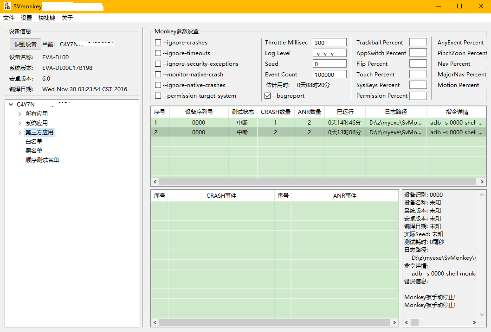

测试过程监控ANR和CRASH以及其他EXCEPTION。

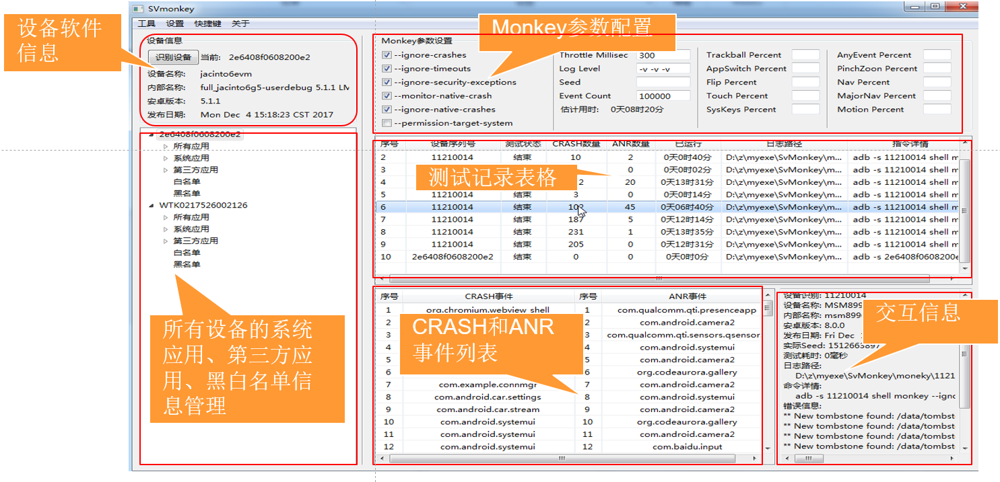

实时保存logcat信息。

测试结束可以导出Excel格式的测试报告，统计发生ANR和CRASH数量以及发生的包名。

# 二、使用准备

1. java语言编写，依赖java环境，运行环境为windows

2. 依赖adb，把adb配置为环境变量

3. 添加依赖的jar包

   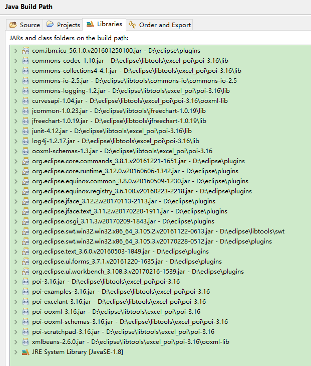

4. 打包成jar后使用java命令运行

    java -jar SVmonkey.jar

5. 也可以把jar打包成exe后双击运行

# 三、执行monkey测试

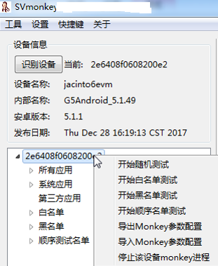

* 随机测试：查找设备后，配置monkey参数，在待测设备上右键，点击随机测试。（不指定应用程序包，进行随机测试）

* 指定包测试：到所有应用、系统应用等子列表下，右键，点击“对此程序包进行测试”

* 白名单测试：待测设备ID上右键->开始白名单测试（需要先往白名单中添加应用程序包）

* 黑名单测试：待测设备ID上右键->开始黑名单测试（需要先往黑名单中添加应用程序包）

* 顺序名单测试：待测设备ID上右键->开始顺序名单测试（需要先往名单中添加应用程序包），以当前的配置对该名单中每个包依次进行测试）

# 四、测试报告

测试结束，右键对应的测试记录，即可导出报告到excel。

   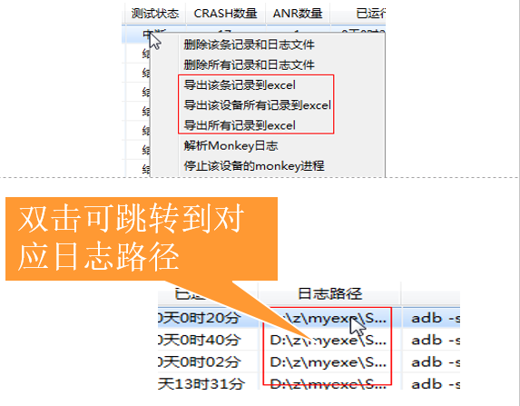

   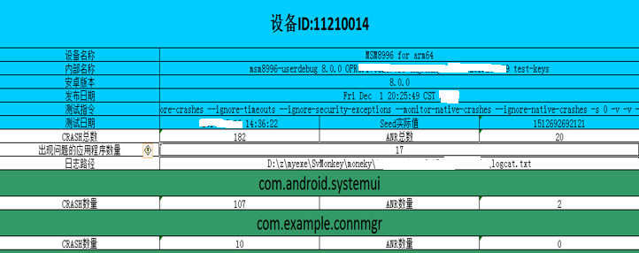

# 五、其他功能

* 安装apk：在对应设备的第三方应用上右键->安装第三方apk，支持多选安装。

   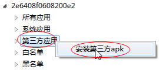
  
* 卸载第三方应用:在对应设备下的第三方应用下在待测应用上右键->卸载该应用。

   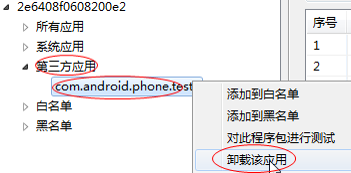

* 解析已有monkey日志：在测试记录表格中右键->解析Monkey日志，能解析使用命令行执行monkey命令时重定向输出的monkey日志，解析后会把解析结果作为一次monkey测试记录添加到表格中。

   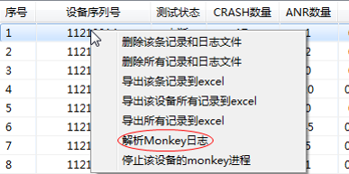

* 导出和导入monkey参数：配置好monkey参数后，右键待测设备，即可导出该配置，或导入新的配置。
  （配置文件后缀“.properties” ）

   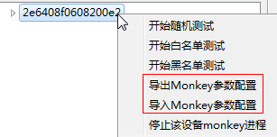

# 六、参数说明

--ignore-crashes: 是否在出现crash时继续测试。

--ignore-timeouts: 是否在出现anr时继续测试。

--ignore-security-exceptions: 是否在出现指定当应用程序发生许可错误时（如证书许可，网络许可等）继续测试。

--monitor-native-crash:是否监视本地代码crash事件。

--ignore-native-crashes:是否忽略本地代码crash事件继续测试（监视本地代码crash事件前提下可用）。

--permission-target-system:是否是运行时权限系统（android6.0及以上）

Throttle Millisec: 两个事件之间发送的时间间隔，单位毫秒。

Log Level: 输出日志等级，由低到高分别为-v , -v -v , -v -v -v

Seed: 随机事件种子值（用于产生随机事件序列）。

Event Count: monkey测试总事件数。

## *注意：如果配置了事件百分比，则所有事件的百分比都应该填写，且所有事件加起来的值应该为100%*

Trackball Percent: 轨迹事件的百分比(轨迹事件由一个或几个随机的移动组成，有时还伴随有点击)。

AppSwitch Percent: Activity启动事件百分比。

Flip Percent: 键盘翻转事件百分比。

Touch Percent: 触摸事件的百分比(触摸事件是一个down-up事件)。

SysKeys Percent: 系统按键事件的百分比(这些按键通常被保留，由系统使用，如Home、Back、Start Call、End Call及音量控制键)

AnyEvent Percent: 其它类型事件的百分比。它包罗了所有其它类型的事件，如：按键、其它不常用的设备按钮、等等（这个按键可能会按到power，因此可考虑设置为0）。

PinchZoon Percent: 缩放事件百分比。

Nav Percent: 基本导航事件的百分比(导航事件由来自方向输入设备的up/down/left/right组成)。

MajorNav Percent: 主要导航事件的百分比(这些导航事件通常引发图形界面中的动作，如：5-way键盘的中间按键、回退按键、菜单按键)。

Motion Percent: 滑动事件的百分比(滑动事件由屏幕上某处的一个down事件、一系列的伪随机事件和一个up事件组成)。

Permission Percent: 权限百分比，申请运行时权限事件的百分比

# 七、常见问题

一、没有root的设备可能会有如下错误导致monkey提前结束，root设备即可。Root方法:选中设备后按下 Ctrl + R(一般不需要root,很多设备也不能root).

或者设备连接电脑时，允许运行USB调试。

   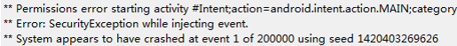

二、monkey参数中所有事件的百分比之和必须等于100%,或者不填，否则执行失败（提示如下图中错误信息）。

   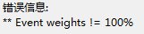   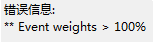

三、设备软件信息获取失败显示未知:请尝试root后再点击识别设备。(一般不需要root,很多设备也不能root).

四、停止monkey测试需要待测设备支持，在adb shell中执行ps | grep monkey能找到monkey进程，否则不支持结束该设备的monkey测试，需要手动停止（重启待测设备，有可能还需要重启SVmonkey）。

# 八、编译打包好的可执行文件下载

微信扫码关注公众号输入 monkey 或者 猴子 即可获取试用

   
